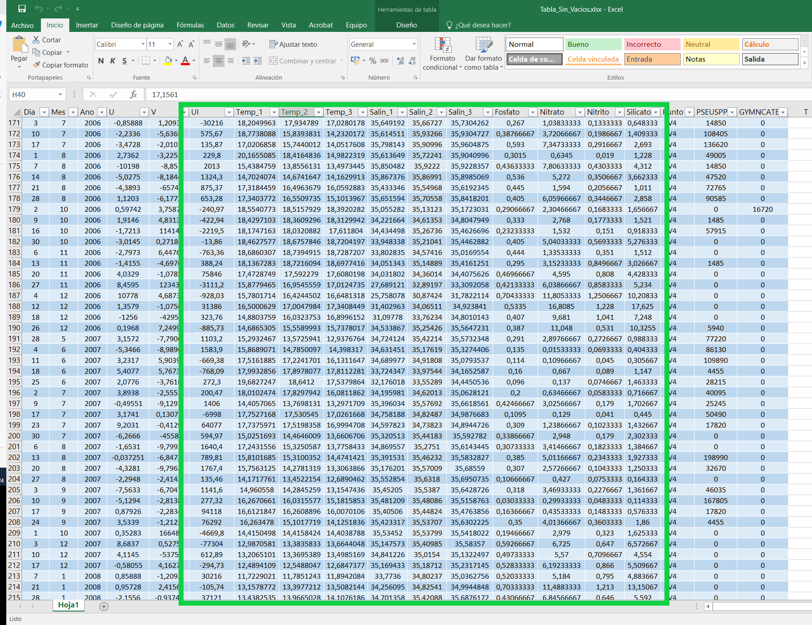
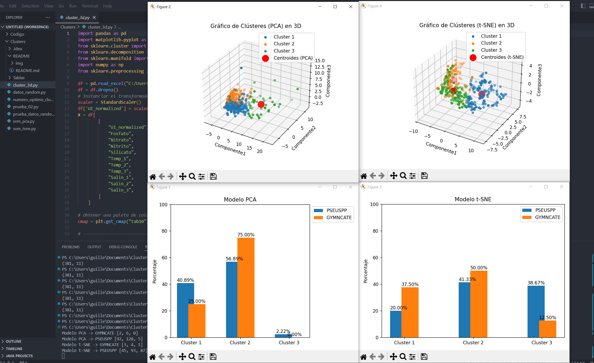
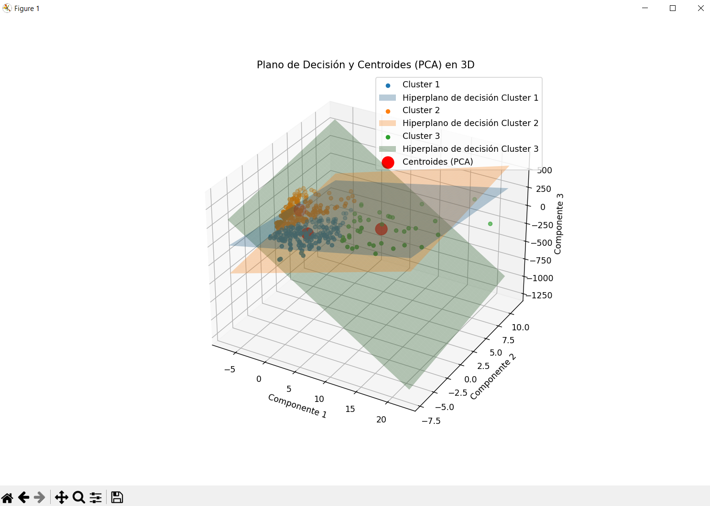
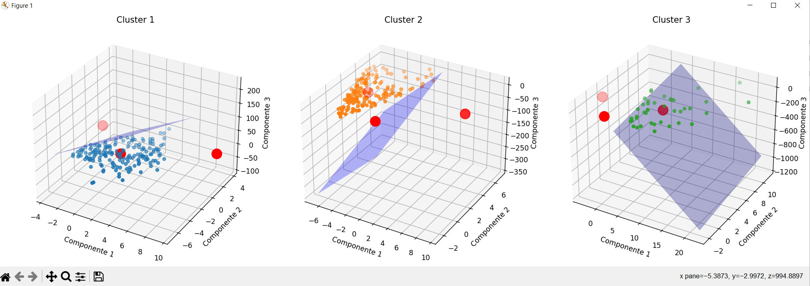

# Categorización tipos de aguas

## Paso 1: Agrupación tablas con Python y libería Pandas&#x20;

Ejemplos de uso:

```python
import pandas as pd

df_temp_salin_2002_06 = pd.read_excel("C:/Users/usuario/Documents/hechos/TempSalin_2002_06_V4.xlsx")
df_temp_salin_2006_12 = pd.read_excel("C:/Users/usuario/Documents/hechos/TempSalin_2006_12_V4.xlsx")
df_afloramiento = pd.read_excel("C:/Users/usuario/Documents/hechos/Afloramiento_2002_2012.xlsx")
df_nutrientes = pd.read_excel("C:/Users/usuario/Documents/hechos/Nutrientes.xlsx")
df_pn_gc = pd.read_excel("C:/Users/usuario/Documents/hechos/PseudoNitzschia_GymnodiniumCatenatum.xlsx")


df_merged_02_06 = (
    pd.merge(df_afloramiento, df_temp_salin_2002_06, on=["Dia", "Mes", "Ano"])
    .merge(df_nutrientes, on=['Dia','Mes','Ano'])
    .merge(df_pn_gc, on=['Dia','Mes','Ano'])
    .drop_duplicates(subset=['Dia','Mes','Ano'])
    # .dropna(how='any')
    .to_excel("C:/Users/usuario/Documents/hechos/Tabla_Final_02_06.xlsx", index=False)
)

df_merged_06_12 = (
    pd.merge(df_afloramiento, df_temp_salin_2006_12, on=["Dia", "Mes", "Ano"])
    .merge(df_nutrientes, on=['Dia','Mes','Ano'])
    .merge(df_pn_gc, on=['Dia','Mes','Ano'])
    .drop_duplicates(subset=['Dia','Mes','Ano'])
    .dropna(how='any')
    .to_excel("C:/Users/usuario/Documents/hechos/Tabla_Final_06_12.xlsx", index=False)
)  

df_concatendas = pd.concat([df_merged_02_06, df_merged_06_12], ignore_index=True).to_excel("C:/Users/guille/Documents/hechos/Tabla_Final_Concatenadas.xlsx", index=False)
```

En este caso tenemos varias tablas de datos de diferentes tramos de años (2002-2006 // 2006-2012).&#x20;

1. En primer lugar importamos la librería pandas para leer las hojas de Excel
2. Después creamos un dataframe para cada periodo de años y juntamos los distintos dataframes en base al Dia, Mes y Año
3. Finalmente concatenamos tanto df\_merged\_02\_06 con df\_merged\_06\_12 en una sola y respetando el orden&#x20;

## Paso 2: Obtención columnas deseadas

En este caso normalizamos los datos de la columna UI

```python
import pandas as pd
import numpy as np
from sklearn.preprocessing import StandardScaler

df = pd.read_excel("C:/Users/usuario/Documents/Clusters/Tablas/Tabla_Sin_Vacios.xlsx")
df = df.dropna()
# Instanciar el transformador
scaler = StandardScaler()
df['UI_normalized'] = scaler.fit_transform(df[['UI']])
X = df[
        [
            "UI_normalized",
            "Fosfato",
            "Nitrato",
            "Nitrito",
            "Silicato",
            "Temp_1",
            "Temp_2",
            "Temp_3",
            "Salin_1",
            "Salin_2",
            "Salin_3",
        ]
    ]

# Obtener una paleta de colores
cmap = plt.get_cmap("tab10")
```

Ahora vamos a coger de la tabla de abajo las columnas que nos interesen para trabajar con ellas

1. Importamos las librerías necesarias
2. Creamos el df leyendo la tabla de Excel y eliminamos las filas con algun valor null con la función dropna()
3. En este caso normalizamos los valores de UI debido a sus valores y para que tengan un mejor ajuste
4. Y finalmente cogemos las columnas necesarias

<figure><figcaption></figcaption></figure>

## Paso 3: Aplicación de diferentes métodos de reducción de dimensionalidad

### Método PCA

```python
def pca_01():
    # Aplica PCA para reducir la dimensionalidad a 3 dimensiones
    pca = PCA(n_components=3)
    X_pca = pca.fit_transform(X)

    # Aplica KMeans para agrupar los datos
    kmeans = KMeans(n_clusters=3, random_state=0)
    clusters = kmeans.fit_predict(X_pca)
    centroids_pca = kmeans.cluster_centers_

    # Cogemos los índices de las columnas PSEUSPP y GYMNCATE
    indice_PSEUSPP = df.columns.get_loc("PSEUSPP") 
    indice_GYMNCATE = df.columns.get_loc("GYMNCATE")

    conteos_cluster_PSEUSPP = [0] * 3
    conteos_cluster_GYMNCATE = [0] * 3
    porcentajes = []
    total_PSEUSPP = 0
    total_GYMNCATE = 0
    
    # Iterar sobre cada cluster
    for i in range(3):
        # Obtener los índices de las filas en X correspondientes al cluster i
        indices_cluster_i = np.where(clusters == i)[0]
        
        # Recogemos todos los valores de las columnas PSEUSPP y GYMNCATE 
        valores_cluster_PSEUSPP = df.iloc[indices_cluster_i, indice_PSEUSPP].values
        valores_cluster_GYMNCATE = df.iloc[indices_cluster_i, indice_GYMNCATE].values
        
        # Contamos cuántas veces los valores de PSEUSPP y GYMNCATE son mayores que 0
        conteos_cluster_PSEUSPP[i] = np.sum(valores_cluster_PSEUSPP > 0)
        conteos_cluster_GYMNCATE[i] = np.sum(valores_cluster_GYMNCATE > 0) 
      
        # Vamos acumulando todos los conteos para ambas columnas  
        total_PSEUSPP += conteos_cluster_PSEUSPP[i]
        total_GYMNCATE += conteos_cluster_GYMNCATE[i]

    for i in range(3):
        #Calculamos el % en relación al total 
        porcentaje_PSEUSPP = (conteos_cluster_PSEUSPP[i]/total_PSEUSPP) * 100
        porcentaje_GYMNCATE = (conteos_cluster_GYMNCATE[i]/total_GYMNCATE) * 100

        porcentajes.append((porcentaje_PSEUSPP, porcentaje_GYMNCATE))
        
    # Obtenemos el número de clusters en relación al número de porcentajes en este caso    
    num_clusters = len(porcentajes)
    # Creamos una lista con valores desde el 0 al número de clusters - 1
    x = np.arange(num_clusters)

    # Nombres de las etiquetas de cada uno de los clusters
    labels = [f'Cluster {i+1}' for i in range(num_clusters)]

    # Ancho de las barras
    width = 0.35
    
    # Obtenemos los valores de los porcentajes en cada columna
    porcentaje_PSEUSPP = [p[0] for p in porcentajes]
    porcentaje_GYMNCATE = [p[1] for p in porcentajes]

    # Crear el gráfico de barras
    fig, ax = plt.subplots()
    ax.bar(x - width/3, porcentaje_PSEUSPP, width, label='PSEUSPP')
    ax.bar(x + width/3, porcentaje_GYMNCATE, width, label='GYMNCATE')

    # Etiquetas, título y leyenda
    ax.set_ylabel('Porcentaje')
    ax.set_title('Modelo PCA')
    ax.set_xticks(x)
    ax.set_xticklabels(labels)
    
    # Establecemos el valor mínimo y máximo además del intervalo de las lineas 
    # del eje Y
    yticks_interval = 20
    ylim_min = 0
    ylim_max = 100
    ax.set_yticks(np.arange(ylim_min, ylim_max + yticks_interval, yticks_interval))

    # Agregar etiquetas en los ticks del eje y con los valores exactos 
    # de cada porcentaje
    for i in range(num_clusters):
        ax.text(x[i] - width/3, porcentaje_PSEUSPP[i] + 1, f'{porcentaje_PSEUSPP[i]:.2f}%', ha='center')
        ax.text(x[i] + width/3, porcentaje_GYMNCATE[i] + 1, f'{porcentaje_GYMNCATE[i]:.2f}%', ha='center')
        
    ax.legend(loc='upper left', bbox_to_anchor=(1, 1))
    plt.tight_layout()
    
    # Crear gráfica 3D
    fig = plt.figure()
    ax = fig.add_subplot(111, projection="3d")

    # Grafica los datos con colores según el clúster y los centroides
    for i in range(3):
        cluster_mask = clusters == i  # Máscara para el cluster actual
        ax.scatter(
            X_pca[cluster_mask, 0],
            X_pca[cluster_mask, 1],
            X_pca[cluster_mask, 2],
            c=[cmap(i)],
            label=f"Cluster {i+1}",
        )
     
    # Aqui dibujamos los centroides   
    ax.scatter(
        centroids_pca[:, 0],
        centroids_pca[:, 1],
        centroids_pca[:, 2],
        marker="o",
        s=200,
        c="red",
        label="Centroides (PCA)",
    )
    
    # Establecemos las etiquetas y el título
    ax.set_xlabel("Componente1")
    ax.set_ylabel("Componente2")
    ax.set_zlabel("Componente3")
    ax.set_title("Gráfico de Clústeres (PCA) en 3D")
    ax.legend()
```

### Método t-SNE

```python
def tsne_01():    
    # Aplica t-SNE para reducir la dimensionalidad a 3 dimensiones
    tsne = TSNE(n_components=3, perplexity=20, random_state=0)
    X_tsne = tsne.fit_transform(X)

    # Aplica KMeans para agrupar los datos
    kmeans = KMeans(n_clusters=3, random_state=0)
    clusters = kmeans.fit_predict(X_tsne)
    centroids_pca = kmeans.cluster_centers_

    # Cogemos los índices de las columnas PSEUSPP y GYMNCATE
    indice_PSEUSPP = df.columns.get_loc("PSEUSPP")
    indice_GYMNCATE = df.columns.get_loc("GYMNCATE")

    conteos_cluster_PSEUSPP = [0] * 3
    conteos_cluster_GYMNCATE = [0] * 3
    porcentajes = []
    total_PSEUSPP = 0
    total_GYMNCATE = 0
    
    # Iterar sobre cada cluster
    for i in range(3):
        # Obtener los índices de las filas en X correspondientes al cluster i
        indices_cluster_i = np.where(clusters == i)[0]

        # Recogemos todos los valores de las columnas PSEUSPP y GYMNCATE 
        valores_cluster_PSEUSPP = df.iloc[indices_cluster_i, indice_PSEUSPP].values
        valores_cluster_GYMNCATE = df.iloc[indices_cluster_i, indice_GYMNCATE].values
        
         # Contamos cuántas veces los valores de PSEUSPP y GYMNCATE son mayores que 0
        conteos_cluster_PSEUSPP[i] = np.sum(valores_cluster_PSEUSPP > 0)
        conteos_cluster_GYMNCATE[i] = np.sum(valores_cluster_GYMNCATE > 0)   
        
         # Vamos acumulando todos los conteos para ambas columnas 
        total_PSEUSPP += conteos_cluster_PSEUSPP[i]
        total_GYMNCATE += conteos_cluster_GYMNCATE[i]

    for i in range(3):
        #Calculamos el % en relación al total
        porcentaje_PSEUSPP = (conteos_cluster_PSEUSPP[i]/total_PSEUSPP) * 100
        porcentaje_GYMNCATE = (conteos_cluster_GYMNCATE[i]/total_GYMNCATE) * 100

        porcentajes.append((porcentaje_PSEUSPP, porcentaje_GYMNCATE))

    # Obtenemos el número de clusters en relación al número de porcentajes en este caso    
    num_clusters = len(porcentajes)
    # Creamos una lista con valores desde el 0 al número de clusters - 1
    x = np.arange(num_clusters)

    # Nombres de las etiquetas de cada uno de los clusters
    labels = [f'Cluster {i+1}' for i in range(num_clusters)]

    # Ancho de las barras
    width = 0.25
    
    # Obtenemos los valores de los porcentajes en cada columna
    porcentaje_PSEUSPP = [p[0] for p in porcentajes]
    porcentaje_GYMNCATE = [p[1] for p in porcentajes]

    # Crear el gráfico de barras
    fig, ax = plt.subplots()
    ax.bar(x - width/3, porcentaje_PSEUSPP, width, label='PSEUSPP')
    ax.bar(x + width/3, porcentaje_GYMNCATE, width, label='GYMNCATE')

    # Etiquetas, título y leyenda
    ax.set_ylabel('Porcentaje')
    ax.set_title('Modelo t-SNE')
    ax.set_xticks(x)
    ax.set_xticklabels(labels)
    
    # Establecemos el valor mínimo y máximo además del intervalo de las lineas 
    # del eje Y
    yticks_interval = 20
    ylim_min = 0
    ylim_max = 100
    ax.set_yticks(np.arange(ylim_min, ylim_max + yticks_interval, yticks_interval))

    # Agregar etiquetas en los ticks del eje y con los valores exactos de cada porcentaje
    for i in range(num_clusters):
        ax.text(x[i] - width/3, porcentaje_PSEUSPP[i] + 1, f'{porcentaje_PSEUSPP[i]:.2f}%', ha='center')
        ax.text(x[i] + width/3, porcentaje_GYMNCATE[i] + 1, f'{porcentaje_GYMNCATE[i]:.2f}%', ha='center')
    
    ax.legend(loc='best', bbox_to_anchor=(1, 1))
    plt.tight_layout()


    # Crear el gráfico 3D
    fig = plt.figure()
    ax = fig.add_subplot(111, projection="3d")

    # Grafica los datos con colores según el clúster y los centroides
    for i in range(3):
        cluster_mask = clusters == i  # Máscara para el cluster actual
        ax.scatter(
            X_tsne[cluster_mask, 0],
            X_tsne[cluster_mask, 1],
            X_tsne[cluster_mask, 2],
            c=[cmap(i)],
            label=f"Cluster {i+1}",
        )
        
    # Dibuja los centroides
    ax.scatter(
        centroids_pca[:, 0],
        centroids_pca[:, 1],
        centroids_pca[:, 2],
        marker="o",
        s=200,
        c="red",
        label="Centroides (t-SNE)",
    )

    # Establecemos las etiquetas y el título
    ax.set_xlabel("Componente1")
    ax.set_ylabel("Componente2")
    ax.set_zlabel("Componente3")
    ax.set_title("Gráfico de Clústeres (t-SNE) en 3D")
    ax.legend()
```

### Visualización

```python
def main():
    # Llamada a las dos funciones y las mostramos
    pca_01()
    tsne_01()
    plt.show()

if __name__ == "__main__":
    main()
```

<figure><figcaption></figcaption></figure>

## Paso 4: Aplicar el Modelo SVM (Support Vector Machine)

Es un algoritmo de aprendizaje supervisado utilizado para la clasificación y regresión. Su objetivo principal es encontrar el hiperplano óptimo que mejor separa las diferentes clases en un conjunto de datos. En el contexto de clasificación, un hiperplano es una superficie que divide un espacio de características en regiones que corresponden a diferentes clases.

```python
def prueba_3d_svm_03():
    # Aplica PCA para reducir la dimensionalidad a 3 dimensiones
    pca = PCA(n_components=3)
    X_pca = pca.fit_transform(X)

    # Aplica KMeans para agrupar los datos
    kmeans = KMeans(n_clusters=3, random_state=0)
    clusters = kmeans.fit_predict(X_pca)
    centroids_pca = kmeans.cluster_centers_
    svm_model = SVC(kernel='linear')  
    svm_model.fit(X_pca, clusters)
    # y_pred = svm_model.predict(X_pca)


   # Crear la figura para los subgráficos 3D
    fig = plt.figure(figsize=(16, 5))

    # Iterar sobre cada subgráfico
    for i in range(3):
        # Crear el subgráfico
        ax = fig.add_subplot(1, 3, i+1, projection='3d')

        # Filtrar los puntos por clúster
        cluster_mask = clusters == i

        # Graficar los datos correspondientes al clúster actual
        ax.scatter(
            X_pca[cluster_mask, 0],
            X_pca[cluster_mask, 1],
            X_pca[cluster_mask, 2],
            c=[cmap(i)],
            label=f"Cluster {i+1}"
        )

        # Visualizar el hiperplano de decisión
        xx, yy = np.meshgrid(np.linspace(X_pca[cluster_mask, 0].min(), X_pca[cluster_mask, 0].max(), 50),
                             np.linspace(X_pca[cluster_mask, 1].min(), X_pca[cluster_mask, 1].max(), 50))
        zz = (-svm_model.intercept_[i] - svm_model.coef_[i][0] * xx - svm_model.coef_[i][1] * yy) / svm_model.coef_[i][2]
        ax.plot_surface(xx, yy, zz, color='blue', alpha=0.3, label='Hiperplano de decisión')

        # Centroides
        ax.scatter(
            centroids_pca[:, 0],
            centroids_pca[:, 1],
            centroids_pca[:, 2],
            marker="o",
            s=200,
            c="red",
            label="Centroides (PCA)",
        )

        # Etiquetas y título
        ax.set_xlabel("Componente 1")
        ax.set_ylabel("Componente 2")
        ax.set_zlabel("Componente 3")
        ax.set_title(f"Cluster {i+1}")

    # Ajustar la disposición de los subgráficos
    plt.tight_layout()


def prueba_3d_svm_01():
    # Aplica PCA para reducir la dimensionalidad a 3 dimensiones
    pca = PCA(n_components=3)
    X_pca = pca.fit_transform(X)

    # Aplica KMeans para agrupar los datos
    kmeans = KMeans(n_clusters=3, random_state=0)
    clusters = kmeans.fit_predict(X_pca)
    centroids_pca = kmeans.cluster_centers_
    svm_model = SVC(kernel='linear')  
    svm_model.fit(X_pca, clusters)
    # y_pred = svm_model.predict(X_pca)
    
    # Crear la figura para el gráfico 3D
    fig = plt.figure(figsize=(12, 10))
    ax = fig.add_subplot(111, projection='3d')

    # Iterar sobre cada clúster
    for i in range(3):
        # Filtrar los puntos por clúster
        cluster_mask = clusters == i

        # Graficar los datos correspondientes al clúster actual
        ax.scatter(
            X_pca[cluster_mask, 0],
            X_pca[cluster_mask, 1],
            X_pca[cluster_mask, 2],
            c=[cmap(i)],
            label=f"Cluster {i+1}"
        )

        # Visualizar el hiperplano de decisión
        xx, yy = np.meshgrid(np.linspace(X_pca[:, 0].min(), X_pca[:, 0].max(), 50),
                             np.linspace(X_pca[:, 1].min(), X_pca[:, 1].max(), 50))
        zz = (-svm_model.intercept_[i] - svm_model.coef_[i][0] * xx - svm_model.coef_[i][1] * yy) / svm_model.coef_[i][2]
        ax.plot_surface(xx, yy, zz, color=cmap(i), alpha=0.3, label=f'Hiperplano de decisión Cluster {i+1}')

    # Graficar los centroides
    ax.scatter(
        centroids_pca[:, 0],
        centroids_pca[:, 1],
        centroids_pca[:, 2],
        marker="o",
        s=200,
        c="red",
        label="Centroides (PCA)",
    )

    # Etiquetas y título
    ax.set_xlabel("Componente 1")
    ax.set_ylabel("Componente 2")
    ax.set_zlabel("Componente 3")
    ax.set_title("Plano de Decisión y Centroides (PCA) en 3D")

    # Mostrar la leyenda
    ax.legend()

def main():
    prueba_3d_svm_01()
    prueba_3d_svm_03()
    plt.show()
    
    
if __name__ == "__main__":
    main()
```

<figure><figcaption></figcaption></figure>

<figure><figcaption></figcaption></figure>

